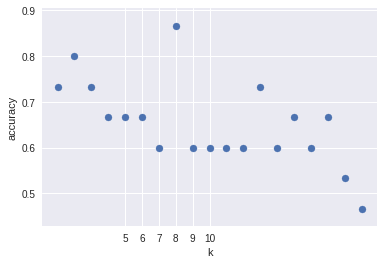

# K-Nearest-Neighbour-Classifier
Tell me who your friends are and I’ll tell you who you are

A sophisticated approach, k-nearest neighbor (kNN) classification , finds a group
of k objects in the training set that are closest to the test object, and bases the assignment of
a label on the predominance of a particular class in this neighborhood. There are three key
elements of this approach: a set of labeled objects, e.g., a set of stored records, a distance
or similarity metric to compute distance between objects, and the value of k, the number of
nearest neighbors. To classify an unlabeled object, the distance of this object to the labeled
objects is computed, its k-nearest neighbors are identified, and the class labels of these nearest
neighbors are then used to determine the class label of the object

to get the best k value there is plot accuracy vs k:

